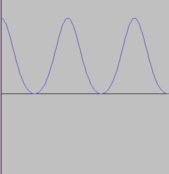
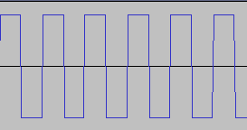

# FM Synth Project 
This is a fun project I started to make a "Frequency Modulated" synthesizer in `python` programming language. I hava a huge interest in electronic music and sound design and also, I studied computer engineering. So, what could be better than a signal/sound processing project? And this is why I started study about how to create and process signals in python and started this project. 

for this project, I used [numpy](http://numpy.org) and [scipy](http://scipy.org) for making signals and also, writing them to files. 

## Goals 
* Generating Sine Waves (with user's desired frequency) -  done
* Generating Square Waves (with user's desired frequency) - done 
* Generating Sawtooth Waves (with user's desired frequency)
* Amplitude Modulations - partly done
* Frequency Modulations 
* Applying FX (distortion, delay, reverb)
* Live controls for modulation and applying FX (like DX7 for example!)

## Documents 
See the [docs](./docs) folder for documents. 

## Example output

### Sine Wave

### Square Wave

