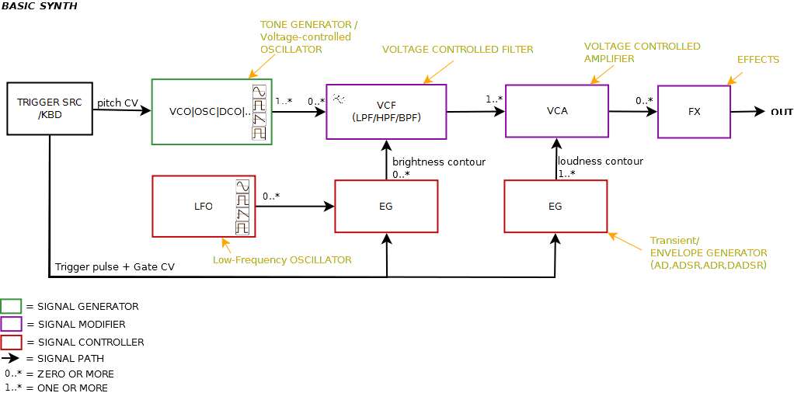

## Electronic oscillators
create raw sounds with a timbre that depends upon the waveform generated. Voltage-controlled oscillators (VCOs) 
and digital oscillators may be used. Harmonic additive synthesis models sounds directly from pure sine waves,
somewhat in the manner of an organ, while frequency modulation and phase distortion synthesis use one oscillator
to modulate another. Subtractive synthesis depends upon filtering a harmonically rich oscillator waveform.
Sample-based and granular synthesis use one or more digitally recorded sounds in place of an oscillator.

## Low frequency oscillator 
(LFO) – an oscillator of adjustable frequency that can be used to modulate the sound rhythmically,
for example to create tremolo or vibrato or to control a filter's operating frequency. LFOs are used in most forms of synthesis.

## Voltage-controlled filter 
(VCF) – "shape" the sound generated by the oscillators in the frequency domain, often under the control of an envelope
or LFO. These are essential to subtractive synthesis.

## ADSR envelopes 
provide envelope modulation to "shape" the volume or harmonic content of the produced note in the time domain with 
the principal parameters being attack, decay, sustain and release. These are used in most forms of synthesis. 
ADSR control is provided by envelope generators.

## Voltage-controlled amplifier (VCA) 
After the signal generated by one (or a mix of more) VCOs has been modified by filters and LFOs, and its waveform 
has been shaped (contoured) by an ADSR envelope generator, it then passes on to one or more voltage-controlled amplifiers
(VCAs). A VCA is a preamp that boosts (amplifies) the electronic signal before passing it on to an external or built-in 
power amplifier, as well as a means to control its amplitude (volume) using an attenuator. The gain of the VCA 
is affected by a control voltage (CV), coming from an envelope generator, an LFO, the keyboard or some other source

## Other sound processing effects units
such as ring modulators and fuzz bass pedals may be encountered

## BASIC FUNCTIONAL BLOCKS

